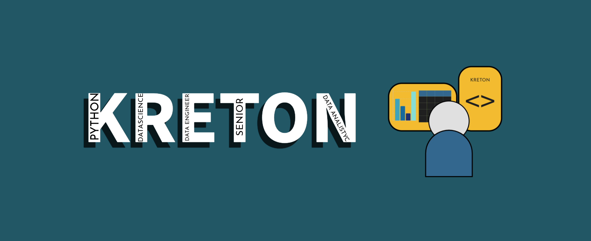
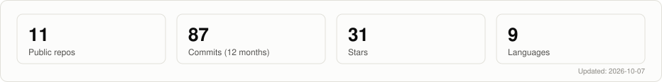
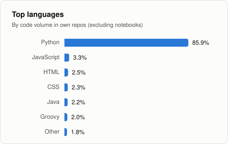
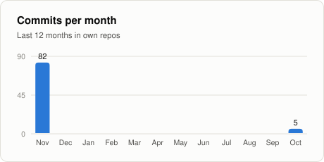

[Español](README.md) · **English**

# Hi, I'm Ronald Barberi 👋

### Data Scientist & Data Engineer · Machine Learning · Big Data/ETL · Analytics

📍 Bogotá, Colombia · 🌎 Open to remote or hybrid · 📄 Resume: [English](assets/cv_ronald_barberi_en.pdf) · [Español](assets/cv_ronald_barberi_es.pdf)

---

## 🧭 About me

**6+ years** building the full data lifecycle in banking, payments, technology, and BPO:
batch and streaming **ingestion** → terabyte-scale **transformation** → statistical **analysis** →
**production ML models** → **business value**. I study Statistics at Fundación Universitaria
Los Libertadores and share what I learn as a technical content creator ([kreton-learning-es](https://github.com/RonaldBarberi/kreton-learning-es)).

| Result | Where |
|--------|-------|
| **5+ billion** records processed with PySpark, Apache NiFi, and Cloudera | Credibanco |
| **+275%** campaign growth, the most profitable of the period | COS (BPO) |
| **~10 h/day** saved by automating ~15 processes with AI agents (Claude) | Samsung |
| Estimated **+20%** promotion effectiveness from classification models | Samsung |
| Estimated **8%** of churning customers recovered after an inferential analysis | Credibanco |
| **Terabyte-scale** feature engineering and **NBO/NBA/Churn** models monitored with MLOps on SageMaker | Itaú |

## 🛠️ Stack

**Data engineering** 

-2a78d6?style=flat-square&logo=cloudera&logoColor=white)

**Data science & ML** 

-eb6834?style=flat-square&logo=anthropic&logoColor=white)

**Analytics, BI & databases** 

**Cloud & DevOps** 
-52514e?style=flat-square&logo=amazonwebservices&logoColor=white)

## 🚀 Featured projects

| Project | What it shows | Result |
|---------|---------------|--------|
| [**data_science**](https://github.com/RonaldBarberi/data_science/blob/main/README.en.md) | Imbalanced classification, time-validated regression, computer vision, and signal validation | ROC-AUC **0.74** (CV) · R² **0.84** · **98.7%** accuracy |
| [**data_analytics**](https://github.com/RonaldBarberi/data_analytics/blob/main/README.en.md) | End-to-end EDA: imputation, outliers, noise, and statistical validation, with pandas and PySpark helpers | Model-ready datasets |
| [**structured_data_etls**](https://github.com/RonaldBarberi/structured_data_etls/blob/main/README.en.md) | Production ETLs: Excel, Outlook, and web → pandas → MySQL, plus stored procedures that cleanse millions of rows | Idempotent loads |
| [**bots_seends**](https://github.com/RonaldBarberi/bots_seends) | Bots that send reports and alerts via Outlook, Telegram, and WhatsApp | Automated reporting |
| [**app_kretonsky**](https://github.com/RonaldBarberi/app_kretonsky) | App to run scripts and monitor logs, runtimes, and final status | Lightweight orchestration |
| [**kreton-learning-es**](https://github.com/RonaldBarberi/kreton-learning-es) | Technical docs in Spanish: PySpark, NiFi, AWS, scikit-learn, XGBoost, Polars… | Knowledge sharing |

## 💼 Recent experience

- **Samsung**: Business Data Coordinator · 07/2026 – 10/2026
- **Itaú** (via Multiplica): Data Scientist · 11/2025 – 07/2026
- **Credibanco** (via Nexos): Data Engineer · 12/2024 – 11/2025
- **Customer Operation Success (COS)**: Data Scientist / Data Mining · 04/2022 – 12/2024

## 📊 GitHub stats

  <picture>
    <source media="(prefers-color-scheme: dark)" srcset="assets/stats/overview-en-dark.svg">
    
  </picture>

  <picture>
    <source media="(prefers-color-scheme: dark)" srcset="assets/stats/langs-en-dark.svg">
    
  </picture>
  <picture>
    <source media="(prefers-color-scheme: dark)" srcset="assets/stats/activity-en-dark.svg">
    
  </picture>

Charts generated daily by a custom <a href=".github/workflows/stats.yml">GitHub Action</a> using the GitHub API, with no third-party services.

---

Updated: 10/2026

