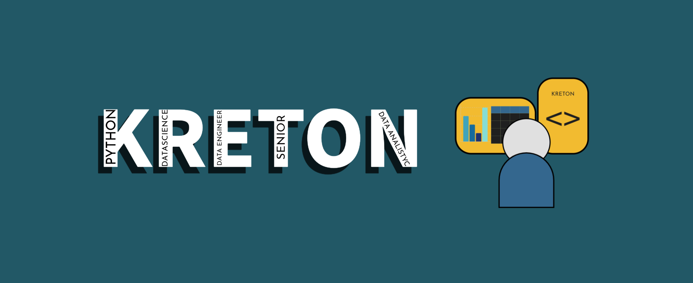

<h1 align="center">
  ¡Hola!, yo soy Ronald Barberi (KretoN) 👋
</h1>

  

<h4 align="center">
  Soy un apasaionado de los datos, especializado en análisis, ciencia e ingeniería, con una trayectoria comprobada en la obtención de resultados de alto impacto. Mi proyecto se basa en la creación de contenido enfocado en programación y aporto una amplia experiencia comercial a mi trabajo. Actualmente curso un pregrado en Estadística en la Fundación Universitaria Los Libertadores en Bogotá D.C., Colombia.
</h4>
<h4>
  Si bien este repositorio es para presentar mis proyectos, en caso de que quieras visualizar mi CV, lo podras encontrar aquí: <a href="https://github.com/RonaldBarberi/RonaldBarberi/blob/main/assets/cv_ronald_barberi.pdf" target="_blank">CV_RONALD_BARBERI</a>
</h4>
<h4 align="center">
  ¡No olvides visitar mis proyectos de Analisis, Ciencia e Ingenieria de datos.
</h4>
<h4 align="center">
  ¡Gracias por interesarte en mi perfil!
</h4>

-----

  

    <h2>🧠 Habilidades Principales</h2>
  

  
  

    
Python

    <ul>
      <li>Scikit-Learn</li>
      <li>TensorFlow</li>
      <li>Keras</li>
      <li>PySpark</li>
      <li>Pandas</li>
      <li>Numpy</li>
      <li>Matplotlib</li>
      <li>Searbon</li>
      <li>Polars</li>
      <li>Selenium</li>
      <li>Os</li>
    </ul>
  

  
  

    
Bases de Datos

    <ul>
      <li>Oracle</li>
      <li>PostgreSQL</li>
      <li>MySQL</li>
      <li>SQL Server</li>
      <li>Hive</li>
      <li>Impala</li>
      <li>SQLite</li>
      <li>MongoDB</li>
      <li>DynamoDB</li>
    </ul>
  

  
  

    
Estadística

    <ul>
      <li>Descriptiva</li>
      <li>Inferencial</li>
      <li>Probabilidad</li>
      <li>Modelos Lineales</li>
    </ul>
  

  

    
Servicios Cloud

    <ul>
      <li>Amazon Web Service</li>
      <li>Cloudera</li>
      <li>Azure</li>
      <li>Google Cloud</li>
    </ul>
  

  

    
R

  

  
  

    
Power BI

  

  
  

    
Office

    <ul>
      <li>Excel (Programación en VBA)</li>
      <li>World</li>
      <li>Outlook</li>
      <li>PowerPoint</li>
    </ul>
  

  

    <h2>📈 Proyectos Principales</h2>
  

  <ul>
      <li><b>Ciencia de Datos</b>: Creación de modelos de aprendizaje automatizo, redes neuronales. Podrás encontrar mis modelos de Machine Learning y Deep Learning <a href="https://github.com/RonaldBarberi/data_science" target="_blank">aquí</a></li>
      <li><b>Ingenieria de Datos</b>: Podrás encontrar proyectos de ETL, de diversas fuentes, múltiples tipos de transformación y limpieza de datos conforme a la necesidad objetivo, con distintas librerias o Frameworks del BigData <a href="https://github.com/RonaldBarberi/data_engineer" target="_blank">aquí</a></li>
      <li><b>Analisis de Datos</b>: Podrás encontrar diversos tipos de Analasis Exploratorio de Datos, para diferentes situeaciones o diferentes modelos de negocio, puedes acceder <a href="https://github.com/RonaldBarberi/data_analytics" target="_blank">aquí</a></li>
      <li><b>Desarrollo</b>: Los repositorios que ves en el inicio aparte de los mencionados son aquellos que traen desarrollos generados, tales como aplicaciones o bots automatizados.</li>
    </ul>

  
<h2 aling="center">☎️ Contactame</h2>

  <samp>
    <h3 align="center">Puedes contactarme por:</h3>
    

       
      
      
    

    

      
       
    

  </samp>

  

    <h2 aling="center">💻 GitHub Perfil Estadísticas</h2>
  

  

  <samp>
    <h3 align="center"> Github stats </h3>
       
    

      
<h3>Languages</h3>

      

        
      

      

        
      

    

    

      
<h3>Statistics</h3>

      

        
      

       
    

  </samp>
  
    

